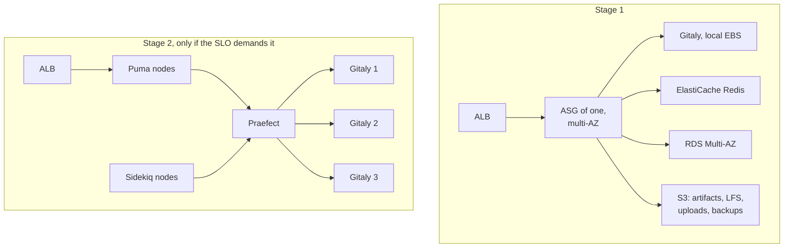

# aws-gitlab-resilience

Making a single-instance GitLab survive failure on AWS, and knowing it broke before the developers tell you.

## Starting point

One EC2 instance running the omnibus package, a root volume and a second volume for repositories and artifacts, with a Multi-AZ RDS behind it.

The database is the only part that survives anything. Everything else is one instance in one availability zone:

- Instance loss is a full outage with no automatic replacement.
- EBS volumes are tied to their AZ, so an AZ failure takes the repository data offline. Recovery means restoring a snapshot elsewhere, and the RPO is however old that snapshot is.
- Omnibus bundles Puma, Sidekiq, Gitaly, Redis and the registry on that one host. Redis holds job state and is not replicated anywhere.
- Artifacts, LFS objects and uploads sit on EBS, so storage growth is an instance problem rather than a bucket problem.
- Upgrades happen in place on the running server.
- Multi-AZ RDS fails over the database while the application tier that needs it stays down.

## What not to do

The instinct is shared storage: put the repositories on EFS and run two instances. That does not work. Gitaly supports local storage only, and NFS or other network file systems are explicitly unsupported for Git repository data. Repository high availability means Gitaly Cluster with Praefect, or it means a single Gitaly with a restore you have actually tested.

## Two stages



**Stage 1 is most of the benefit.** Moving artifacts, LFS, uploads, packages and backups to S3 decouples state from the instance. Redis moves to ElastiCache with Multi-AZ. The instance goes into an auto scaling group of one spanning several AZs behind an ALB, so a failed instance is replaced without anyone being paged, and a failed AZ is a relaunch rather than a rebuild. RDS already survives.

What stage 1 does not fix: the repositories still live on one Gitaly node, so instance replacement means restoring that volume from a snapshot. RPO is the snapshot interval and RTO is the restore time.

**Stage 2 removes that**, at a price. Praefect needs three Gitaly nodes, its own PostgreSQL, and an operational model the team has to actually learn.

I would not jump straight to stage 2. Praefect roughly doubles the number of components that can fail and the number a tired engineer has to reason about at three in the morning. A single Gitaly with hourly snapshots and a restore drill that runs on a schedule usually delivers better real availability per unit of effort than a cluster nobody has debugged under pressure. Go to stage 2 when the measured RTO from stage 1 misses the target, not before.

## Monitoring

The trap is that GitLab returns HTTP 200 from the web UI while Gitaly is down and every push fails. So the primary check clones a real repository.

`canary/git_clone_canary.py` is a Synthetics canary that clones a repo and records how long it took. `monitoring/alarms.tf` wires that up alongside the signals that move earliest:

| Signal | Why it is on the list |
|---|---|
| Clone canary success | The only check that proves git works |
| Sidekiq queue depth | Degrades well before users notice |
| Healthy host count | Fleet is not serving |
| Repository volume free space | A routine cause of total outage |
| RDS connections | Pool exhaustion looks like a hang |

The composite alarm pages only when the clone check and the healthy host count are both in alarm, so one failed probe does not wake anyone.

## Runbook automation

Upgrades stop being `apt upgrade` on a live server. An image pipeline bakes a GitLab AMI at a pinned version, a staging stack is built from it and smoke tested, then the group does an instance refresh. Rollback is the previous AMI. The pipeline has to encode GitLab's required upgrade stops, because major versions cannot be skipped and the path is version-specific.

`ssm/restore-drill.yml` restores the newest backup onto a throwaway instance, runs `gitlab-rake gitlab:check` and `gitlab:git:fsck`, clones a repository to prove the restore is usable, then terminates the instance. Run it on a schedule. A backup nobody has restored is an assumption.

One detail that decides where this automation lives: if the recovery pipeline runs as a GitLab CI job, it is unavailable exactly when GitLab is down. The DR automation belongs in Systems Manager with a trigger outside GitLab. Everything else can stay in GitLab's own pipelines.

## Layout

```
ssm/          restore-drill.yml
monitoring/   alarms.tf
canary/       git_clone_canary.py
```

```
cd monitoring
terraform init -backend=false
terraform validate
```
