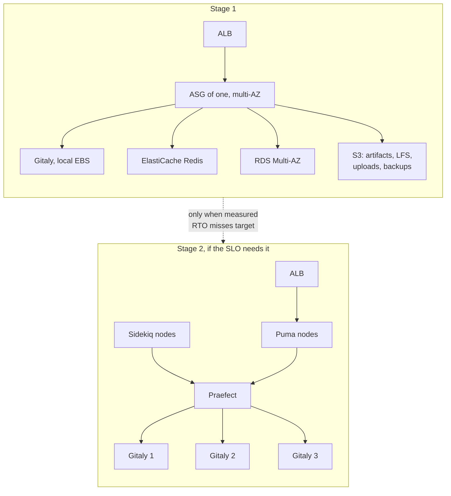

# aws-gitlab-resilience

Making single-instance GitLab survive failure on AWS, and detecting breakage before developers report it.

## Starting point

One EC2 instance running omnibus, a root volume, a second volume for repositories and artifacts, and a Multi-AZ RDS.

The database is the only part that survives anything. Instance loss is a full outage with no replacement. EBS is AZ-bound, so an AZ failure takes repository data offline and recovery is a snapshot restore with the RPO of that snapshot. Omnibus puts Puma, Sidekiq, Gitaly, Redis and the registry on one host, and Redis job state is not replicated. Artifacts and LFS sit on EBS instead of S3. Upgrades happen in place on the running server.

## What does not work

Shared storage. Gitaly supports local storage only; NFS and network file systems are unsupported for repository data. EFS is not an option. Repository HA means Gitaly Cluster with Praefect, or a single Gitaly with a tested restore.

## Target



Stage 1 carries most of the benefit. Object storage moves to S3, Redis to ElastiCache Multi-AZ, and the instance into an auto scaling group of one across AZs behind an ALB, so a failed instance is replaced without a page. What it does not fix: repositories still live on one Gitaly node, so RPO is the snapshot interval and RTO is the restore time.

Stage 2 removes that and costs three Gitaly nodes, a Praefect layer, and its own PostgreSQL.

I would not start there. Praefect roughly doubles the components that can fail and that someone has to debug at three in the morning. A single Gitaly with frequent snapshots and a restore drill that actually runs usually gives better real availability per unit of effort than a cluster nobody has operated under pressure. Move to stage 2 when the measured RTO from stage 1 misses the target, not because the reference architecture says so.

## Monitoring

GitLab returns 200 from the web UI while Gitaly is down and every push fails. So the primary check talks git.

A canary cannot run `git`: the Synthetics runtime is a Lambda layer with Python and a browser driver, and no git binary. It fetches the reference advertisement instead:

```
GET /{project}.git/info/refs?service=git-upload-pack
```

That response is served by Gitaly, not by the web frontend, and it is pkt-line encoded. The canary parses it and requires at least one advertised ref. An HTML error page returning 200 fails on content type, which is the exact false-green this is here to catch.

| Signal | Why |
|---|---|
| Reference advertisement | The only check that proves git works |
| Sidekiq queue depth | Degrades before users notice |
| Healthy host count | Fleet is not serving |
| Repository disk used | Routine cause of total outage |
| RDS connections | Pool exhaustion looks like a hang |

The composite alarm pages only when the git check and the host count are both in alarm, so one failed probe wakes nobody.

## Runbook

Upgrades become an image pipeline: bake an AMI at a pinned version, build and smoke test a staging stack, then instance refresh. Rollback is the previous AMI. The pipeline has to encode GitLab's required upgrade stops, because major versions cannot be skipped.

`ssm/restore-drill.yml` restores onto a throwaway instance, then terminates it. Failures route to termination, so a broken drill does not leave an instance running.

Two things it checks that a naive drill misses. `gitlab-backup` does not include `/etc/gitlab/gitlab-secrets.json` or `gitlab.rb`, and without the secrets file the data restores cleanly while every encrypted value stays unreadable: CI variables, two factor secrets, integration tokens, deploy keys. The drill restores them from a separate bucket first and runs `gitlab-rake gitlab:doctor:secrets` afterwards. It also asserts the AMI version matches the backup, because a backup only restores onto the version and edition it came from.

`ssm/validate_document.py` runs in CI and checks the structure a YAML parse cannot: dangling or backwards `onFailure` targets, steps consuming outputs of steps that run later, and parameters referenced but never declared.

The detail that decides where this lives: a recovery pipeline running as a GitLab CI job is unavailable exactly when GitLab is down. DR automation belongs in Systems Manager, triggered from outside GitLab. Everything else can stay in GitLab's own pipelines.

## Layout

```
ssm/         restore-drill.yml  validate_document.py
monitoring/  alarms.tf
canary/      git_protocol_canary.py
```

```
cd monitoring
terraform init -backend=false
terraform validate
```
